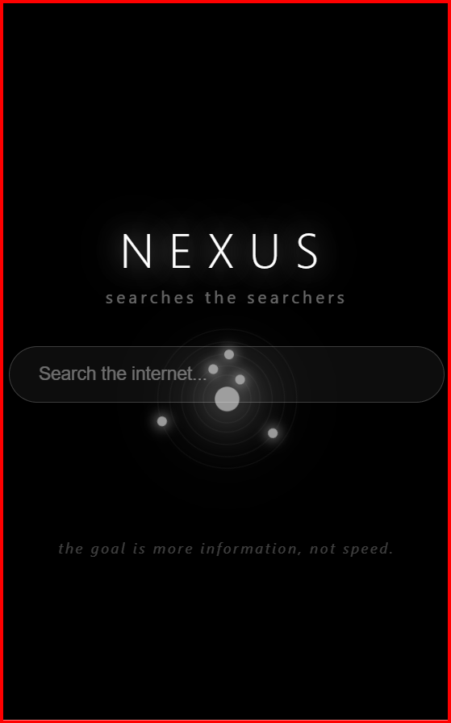

# Nexus

A metasearch engine — Quantity over Speed.

No API keys. No database. No tracking.

---

## Setup

```bash
git clone https://github.com/gv1shnu/nexus.git && cd nexus
npm install
python -m venv venv
source venv/scripts/activate
pip install -r requirements.txt
cd backend && docker-compose up -d
```

## Start

```
cd backend && node server.js
cd frontend && npx serve .
```

---

## Test

```bash
npm test -- --verbose
```

## Screenshot

