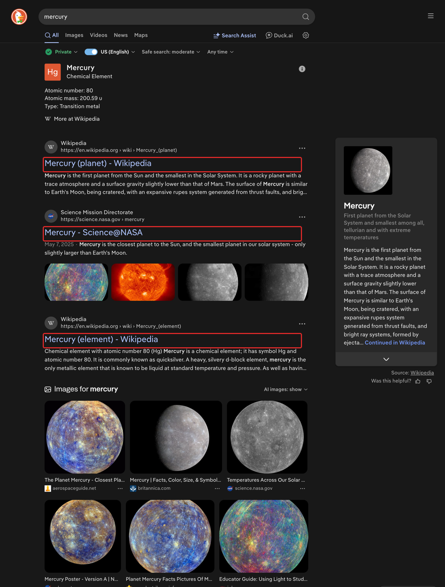
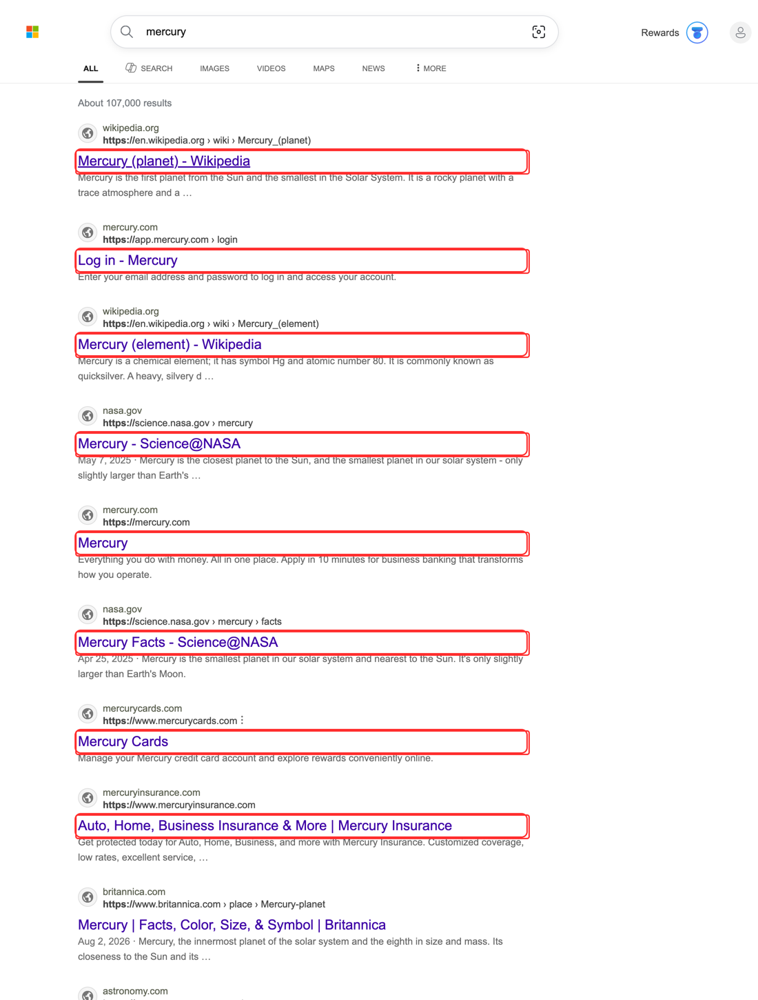
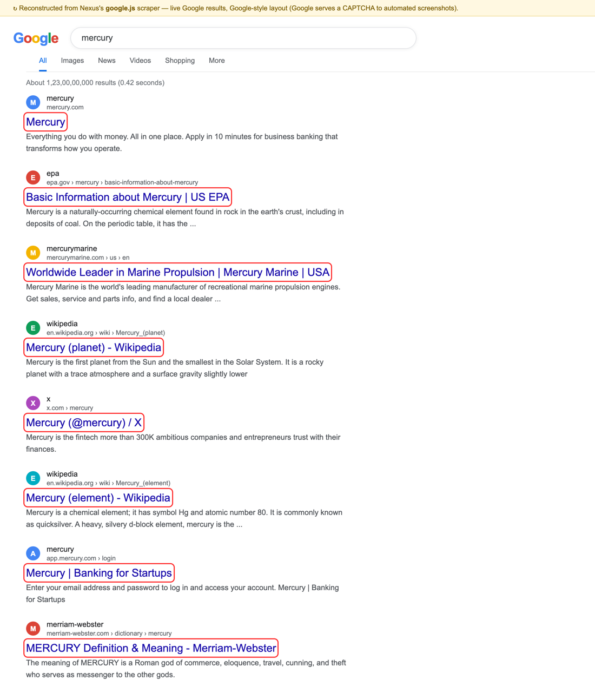

# Nexus

**A metasearch engine that goes wide.** No API keys, no tracking. You type one query,
it fans out to a bunch of sources at once, then merges and ranks everything into a single feed.

The idea is quantity over raw speed: instead of trusting one engine, Nexus asks Google,
DuckDuckGo, a self-hosted SearXNG instance, Wikipedia, StackOverflow, Reddit, and arXiv all
at the same time — plus a small OSINT module for looking up usernames and domains — and
stitches the results together. You get tabs for web, images, videos, news, docs, books, code, academic,
Wikipedia, community, OSINT, and other.

---

## Why go wide? The same query, three different answers

No two engines return the same list — so relying on one means only ever seeing one
engine's opinion. Here's a deliberately ambiguous single-word query, **`mercury`**
(the planet? the element? the fintech? the insurer?), run through three engines on the
same day. The top result **titles are boxed in red**:

| DuckDuckGo | Bing | Google † |
|:---:|:---:|:---:|
|  |  |  |

Line them up and the first page barely agrees past #1:

| Rank | DuckDuckGo | Bing | Google |
|:---:|------------|------|--------|
| 1 | Mercury (planet) — `wikipedia.org` | Mercury (planet) — `wikipedia.org` | **Mercury** (fintech) — `mercury.com` |
| 2 | Mercury — `science.nasa.gov` | **Log in — `app.mercury.com`** | Basic Info on Mercury — `epa.gov` |
| 3 | Mercury (element) — `wikipedia.org` | Mercury (element) — `wikipedia.org` | Mercury **Marine** — `mercurymarine.com` |
| 4 | **Log in — `app.mercury.com`** | Mercury — `science.nasa.gov` | Mercury (planet) — `wikipedia.org` |
| 5 | Mercury Facts — `science.nasa.gov` | Mercury — `mercury.com` | Mercury **@mercury** — `x.com` |
| 6 | Mercury — `mercury.com` | Mercury Facts — `science.nasa.gov` | Mercury (element) — `wikipedia.org` |
| 7 | Mercury — `britannica.com` | Mercury **Cards** — `mercurycards.com` | Log in — `app.mercury.com` |
| 8 | Mercury — `britannica.com` | Mercury **Insurance** — `mercuryinsurance.com` | Mercury (Merriam-Webster) — `merriam-webster.com` |

Three engines, three personalities: **DuckDuckGo** leans encyclopedic (Wikipedia, NASA,
Britannica); **Bing** goes commercial, surfacing Mercury Cards and Mercury Insurance;
**Google** is the most scattered, mixing the fintech, the EPA, a boat-engine maker, an
X profile, and a dictionary. Only *one* result — Wikipedia's "Mercury (planet)" — lands
in every top-3, and not one of the eight rows matches across all three. Same word, three
different worlds — which is exactly why Nexus fans out to many sources and merges them
instead of trusting one.

> **†** Google serves a reCAPTCHA to automated *screenshots*, so its panel is rendered
> from the **real results Nexus's own scraper returns** ([`engines/google.js`](backend/engines/google.js)),
> laid out Google-style and labelled as such on the image. The DuckDuckGo and Bing panels
> are live screenshots. Regenerate any of them:
>
> ```bash
> npm i -D puppeteer
> node docs/serp/serp-compare.js "mercury"        # live DDG + Bing (+ Google on a clean IP)
> node docs/serp/serp-google-render.js "mercury"  # Google panel from the scraper's data
> ```

---

## Sources & tabs

| Source | How it's queried | Feeds |
|--------|------------------|-------|
| **Google** | HTML scrape (no-JS WAP page) | Web |
| **SearXNG** (self-hosted) | aggregator over Docker | Web · Images · Other |
| **DuckDuckGo** (`ddgs` worker + Instant Answer) | Python lib / REST | Web · Videos · News · Books · Docs |
| **Wikipedia** | REST/JSON | Wikipedia |
| **arXiv** | Atom/XML | Academic |
| **StackOverflow** (StackExchange) | REST/JSON | Code |
| **Reddit** (OAuth → RSS → old.reddit) | Atom RSS / OAuth API / HTML | Community · Other |
| **OSINT** (username + domain lookups) | HTTP / crt.sh | OSINT |

A couple of things worth knowing:

- **Images and the "other" tab come from SearXNG** (Bing/Google/Flickr/Pinterest/…), not
  DuckDuckGo — DDG's image endpoint gets 403'd constantly, so it's not worth relying on. The
  "other" tab is just image search with safesearch off, plus safesearch-off Reddit posts shown
  as link cards in the same tab.
- **OSINT only kicks in when your query looks like a single thing**, not a phrase — a **username**
  (checks **~480 platforms** for that handle using the real [Sherlock](https://github.com/sherlock-project/sherlock)
  site database + detection rules, ported to Node in [`util/sherlock.js`](backend/util/sherlock.js)) or a
  **domain** (finds subdomains from certificate-transparency logs via crt.sh, theHarvester-style). The
  Sherlock scan fires ~480 checks across a bounded concurrency pool, so a username query takes ~10–25s
  and, like Sherlock itself, will show some soft-404 false positives.
- **Reddit got hard to scrape in 2026** — Reddit killed unauthenticated `.json` (403) in May 2026 and
  rate-limits the old.reddit HTML search. So the engine tries, in order: the **OAuth API** (if
  `REDDIT_CLIENT_ID`/`SECRET` are set — the only fully reliable path), then Reddit's **Atom `search.rss`**
  with a descriptive User-Agent (free, no key, but rate-limited), then the **old.reddit HTML** scrape —
  taking the first that returns posts. Without credentials it still works via RSS, just subject to
  Reddit's rate limiting.

---

## How it fits together

```
                         ┌──────────────────────────────┐
  Browser                │  Express backend (port 8000) │
  (frontend/index.js)    │                              │
      │  ▲               │  /api/search        (ranked) │
      │  │ SSE / fetch   │  /api/search/stream (live)   │
      │  │               │  /api/resolve-date  (SSRF-   │
      ▼  │               │  /api/stats          guarded)│
  live-streamed          └───────────────┬──────────────┘
  or ranked results                      │ parallel fan-out
   ┌────────┬─────────┬───────────┬───────────┬─────────┬──────────┬──────────┬─────────┐
   ▼        ▼         ▼           ▼           ▼         ▼          ▼          ▼         ▼
 Google  SearXNG  DuckDuckGo  Wikipedia    arXiv    Stack-     Reddit     OSINT   (metrics)
 (WAP    (Docker) (ddgs        (REST)      (XML)    Overflow   (RSS/     module
  scrape)         worker)                           (REST)     OAuth)
```

The backend also serves the static frontend, so the whole thing runs as one process.

### How results get ranked

Ranking blends two signals, each squashed to `[0,1]` so neither one wins just by having a
bigger scale, with a few small tie-breakers on top — the details live in
[`backend/util/ranking.js`](backend/util/ranking.js):

- **BM25** ([`util/bm25.js`](backend/util/bm25.js)) — classic Okapi BM25 over each result's title
  and content, so term frequency, rarity, and document length all factor in.
- **Reciprocal Rank Fusion** — `score = Σ 1/(60 + rank)` across engines. If several engines
  independently surface the same URL near the top, it gets a boost.
- **Priors** — gentle nudges for source trust and recency to settle ties.

There's also a relevance filter that throws out results whose title and content contain *none*
of your query terms, so the text tabs don't fill up with loosely-related junk.

### Two ways to search

| Sort mode | Endpoint | Why it works this way |
|-----------|----------|------------------------|
| **Date** (default) | `/api/search/stream` (SSE) | Results stream in live, newest first, so it feels fast. |
| **Relevance** | `/api/search` (blocking) | BM25 + RRF need the whole result set at once, so there's nothing to stream. |

### Smart routing — which engines a query actually needs

Fanning out to everything is the default, but not every engine suits every query — a
stack trace doesn't belong on arXiv, and a physics paper isn't on Reddit. A small
**deterministic classifier** ([`util/classifier.js`](backend/util/classifier.js)) reads
the query and picks the engines that fit it. It's pure rules — curated keywords,
phrases, and regexes, no ML and no network — so the same query always routes the same way.

| Query looks like… | Intent | Engines it favors |
|-------------------|--------|-------------------|
| `TypeError in react useEffect` | **code** | StackOverflow · GitHub\* · Google · DDG |
| `attention is all you need paper` | **academic** | arXiv · Google · Wikipedia |
| `best mechanical keyboard reddit` | **social** | Reddit · X\* · DDG · Google |
| `latest news on openai` | **news** | DDG · Google · Bing\* |
| `who is alan turing` | **reference** | Wikipedia · DDG · Google |
| `github.com` · `8.8.8.8` | **entity** | OSINT |
| anything else | **general** | Google · SearXNG · DDG · Wikipedia |

`*` = recommended but not wired up yet (GitHub, X, Bing) — the classifier names them so
the roadmap is visible, but they're filtered out of what actually runs. A general
fallback is always appended, so routing never comes back empty.

```bash
# See the routing decision for a query (read-only):
curl "localhost:8000/api/classify?q=how+to+center+a+div"

# Route a real search to only the suitable engines (opt-in — default still goes wide):
curl "localhost:8000/api/search?q=transformer+paper&route=auto"
```

### Bits I'm happy with

- **A Python worker that stays warm** ([`engines/ddg_worker.py`](backend/engines/ddg_worker.py) +
  [`util/pyworker.js`](backend/util/pyworker.js)) — the `ddgs` interpreter is kept alive and
  handled over a thread pool, instead of paying Python's startup cost on every single search.
- **Metrics** ([`util/metrics.js`](backend/util/metrics.js)) — each search logs per-engine latency,
  result counts, cache hits, and how much the filter/dedup step trimmed, to `metrics.jsonl`.
  You can see it all at `/api/stats`, the [`/stats`](frontend/stats.html) dashboard, or
  `node backend/stats.js`.
- **An SSRF guard** ([`util/ssrf.js`](backend/util/ssrf.js)) — `/api/resolve-date` will only fetch
  public `http(s)` hosts. Loopback, private ranges, and cloud-metadata IPs are blocked, and it
  re-checks after DNS resolution so a rebinding trick can't sneak through.
- **A small TTL cache** ([`util/cache.js`](backend/util/cache.js)) so repeated queries skip the
  whole fan-out.
- **Parallel pagination** — Wikipedia / arXiv / StackOverflow pages are fetched side by side.
- **Python that resolves anywhere** ([`util/python.js`](backend/util/python.js)) — it finds a
  project venv or a system `python3`, whatever OS you're on.

---

## What you need

- **Node.js** 18+
- **Python** 3.10+ (for the DuckDuckGo `ddgs` worker and date extraction)
- **Docker** (optional — only if you want SearXNG, which powers the Web, Images, and Other tabs)

## Getting set up

```bash
git clone https://github.com/gv1shnu/nexus.git && cd nexus

# Node deps
npm install

# Python deps (the backend auto-detects this venv)
python3 -m venv venv
source venv/bin/activate          # Windows: venv\Scripts\activate
pip install -r requirements.txt

# Optional: SearXNG for the Web / Images / Other tabs
cd backend && docker compose up -d && cd ..
```

## Running it

The backend serves the frontend too, so it's a single command:

```bash
# With SearXNG running:
SEARXNG_URL=http://localhost:8080 node backend/server.js

# Or without it — SearXNG-fed tabs just stay empty:
node backend/server.js
```

Then open <http://localhost:8000> (and <http://localhost:8000/stats.html> for the metrics dashboard).

> Engines fail on their own. If Python, Docker, or some upstream is down, that one gets skipped
> and everything else still comes back.

### Environment variables

| Variable | Default | What it does |
|----------|---------|--------------|
| `PORT` | `8000` | Port the backend listens on |
| `SEARXNG_URL` | unset | SearXNG base URL (e.g. `http://localhost:8080`). Unset = SearXNG off |
| `NEXUS_PYTHON` | auto | Point at a specific Python interpreter |
| `NEXUS_DEBUG` | unset | Surface the Python worker's stderr in the logs |
| `REDDIT_CLIENT_ID` / `REDDIT_CLIENT_SECRET` | unset | Optional Reddit "script" app creds ([reddit.com/prefs/apps](https://www.reddit.com/prefs/apps)). Set both to use the reliable OAuth API; unset falls back to the free RSS/HTML scrape |
| `SHERLOCK_CONCURRENCY` / `SHERLOCK_TIMEOUT_MS` / `SHERLOCK_DEADLINE_MS` | `70` / `5000` / `25000` | Tune the OSINT username scan (pool size, per-site timeout, overall deadline) |
| `SHERLOCK_INCLUDE_NSFW` | unset | Include Sherlock's NSFW-flagged sites in username lookups (off by default) |

---

## Tests

```bash
npm test                 # everything
npx jest ranking.test.js # just the ranking (BM25 + RRF + filter) tests
node backend/stats.js    # print aggregated stats from metrics.jsonl
```

- [`backend/ranking.test.js`](backend/ranking.test.js) — deterministic ranking + filter tests
- [`backend/classifier.test.js`](backend/classifier.test.js) — deterministic query → engine routing tests
- [`backend/server.test.js`](backend/server.test.js) — API tests with the engines mocked out
- [`backend/engines.test.js`](backend/engines.test.js) — live integration tests (these hit the network)

---

## Where it's headed

- **Wire up the routed-but-unbuilt engines** — the [query classifier](backend/util/classifier.js)
  already recommends **GitHub** (code) and **X** (social); add those engines and flip them on in the
  registry
- **Deeper OSINT** — cut username false positives with per-site fingerprints, and add email lookups
  (Holehe) plus an entity-correlation graph (Neo4j)
- **Redis** for caching, and a real search index (OpenSearch / Meilisearch)
- **Rank tuning** — learn the weights on the BM25 / RRF blend instead of hand-picking them

---

## Credits

- Username OSINT uses the **[Sherlock Project](https://github.com/sherlock-project/sherlock)** site
  database (`backend/util/sherlock_sites.json`, MIT — see `backend/util/SHERLOCK-LICENSE.txt`); the
  detection algorithm is reimplemented in Node in `backend/util/sherlock.js`.
